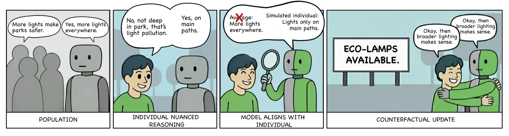

# HugAgent: A Human Simulation Benchmark for Individual-Level Reasoning

**EMNLP 2026, main conference** · [Paper](https://arxiv.org/abs/2510.15144) · [Project page](https://jajamoa.github.io/HugAgent/) · [Benchmark data](Benchmark/) · [Interview chatbot](https://github.com/jajamoa/trace-your-thinking) · [BibTeX](#citation)

Chance Jiajie Li\*, Zhenze Mo\*, Yuhan Tang\*, Ao Qu, Jiayi Wu, Kaiya Ivy Zhao, Yulu Gan, Jie Fan, Jiangbo Yu, Hang Jiang, Paul Pu Liang, Jinhua Zhao, Luis Alberto Alonso Pastor, Kent Larson  
MIT Media Lab, MIT EECS, MIT IDSS, MIT CEE, MIT DUSP, Northeastern University, Brown University, McGill University · \*equal contribution



> Can AI reason like you, or only answer like you?

HugAgent (Human-Grounded Agent Benchmark) evaluates whether a language model can simulate how a specific person reasons and updates their beliefs, given only that person's own words. It scales the think-aloud method with an LLM-driven interview chatbot. Ground truth comes from the participants themselves, reported in structured questionnaires the models never see.

**Two tasks.** *Belief state inference*: from an interview excerpt, infer a belief the person holds but never stated. *Belief dynamics update*: given a new scenario, predict how this person's stance moves, on their own scale.

**Data.** 54 participants (quality-filtered from 120), 3 contested domains (healthcare, surveillance, zoning), 1,742 items, ~85% human test-retest ceiling. Everything is open: data, pipeline, chatbot. A synthetic track (`Benchmark/synth_500.zip`) is included for controlled stress testing and is not used in the paper.

**Finding.** Models recover what a person believes: the best trail the human ceiling by 7 to 9 points. They struggle to predict how a person changes their mind: best model 68.6% vs. 85.7% for humans, and the gap holds across every model family tested.

## News

- **2026-08** Accepted to EMNLP 2026, main conference.
- **2025-12** Earlier versions presented at NeurIPS 2025 workshops: PersonaLLM (oral) and LAW (spotlight).
- A scaled-up v2, with more participants and more topics, is in preparation.

## Usage

### Core Scripts

#### Data Processing
```bash
cd Benchmark/
python process_data.py
# Processes ../raw_data/main_raw_data/ folder and generates sample.jsonl

# With options (space-separated context lengths)
python process_data.py --context-lengths short medium --max-workers 5 --max-users 20

# Single context length
python process_data.py --context-lengths long --task-type belief_attribution --topic zoning

# All context lengths (default)
python process_data.py --task-type belief_update --topic healthcare
```

#### Model Evaluation  
```bash
cd Benchmark/
# Single model
python evaluate_qwen.py --model qwen-plus --benchmark_path sample_belief_attribution_healthcare.jsonl

# Debug mode (sequential, interactive)
python evaluate_qwen.py --model qwen-plus --debug

# Batch evaluation (all models in parallel)
./run_all_evaluations.sh
```

**Evaluation Options:**
- `--benchmark_path`: JSONL file path (default: sample_belief_attribution_healthcare.jsonl)
- `--model`: qwen-max, qwen-plus, qwen-turbo, qwen2.5-{72b,32b,14b,7b,3b,1.5b,0.5b}-instruct
- `--temperature`: Generation temperature 0.0-1.0 (default: 0.1)
- `--no-demographics`: Exclude participant demographics from prompt
- `--no-context`: Exclude context QAs from prompt  
- `--max-workers`: Parallel workers for API calls (default: 3)
- `--debug`: Sequential processing with full prompt/response display
- `--swap-experiment`: Use next participant's data for prediction (extreme test)

**Data Processing Options:**
- `--task-type`: Task type (choices: belief_attribution, belief_update; default: belief_attribution)
- `--topic`: Topic to process (choices: zoning, surveillance, healthcare; default: zoning)
- `--context-lengths`: Context lengths to generate (choices: short, medium, long; default: all; multiple values separated by spaces)
- `--max-workers`: Maximum parallel workers (default: 6)
- `--max-users`: Maximum user folders to process (default: 10)

### Human Annotation Tool

Launch interactive annotation interface:
```bash
# Open in browser
open human_annotation_tool.html

# Or serve locally
python -m http.server 8000
```

**Usage:**
1. Drag JSONL data files (belief attribution or belief update)
2. Select context length and start annotation
3. Export your annotations as JSON for analysis

## Benchmark Tasks

**Belief-State Inference (BSI)**: Recover a participant’s latent belief state and factor polarity from prior conversational responses.
Models predict whether one factor is believed to have a positive, negative, or neutral effect on another.

**Belief-Dynamics Update (BDU)**: Predict how belief states and reasoning weights change when participants encounter new evidence or counterfactual interventions, given their prior beliefs and contextual cues.

## Files

```
├── raw_data/
│   ├── main_raw_data/           # Main participant data
│   ├── aux_raw_data/            # Auxiliary participant data  
│   └── survey_content/          # Survey questions and mappings
├── Benchmark/
│   ├── process_data.py          # Extract QA pairs from ../raw_data/main_raw_data/
│   ├── evaluate_qwen.py         # Run model evaluation with ToM prompts
│   ├── run_all_evaluations.sh   # Batch evaluation script (parallel)
│   ├── llm_utils.py            # Qwen API wrapper with debug support
│   ├── sample_belief_*.jsonl    # Generated benchmark questions
│   └── evaluation_results_*.json # Model performance results
└── human_annotation_tool.html   # Interactive annotation interface
```

## Output Format

Evaluation generates `evaluation_results_{model}_by_difficulty.json`:
```json
{
  "simple": {"total": 50, "correct": 39, "accuracy": 0.78, "answers": [...]},
  "medium": {"total": 50, "correct": 40, "accuracy": 0.80, "answers": [...]},
  "hard":   {"total": 50, "correct": 34, "accuracy": 0.68, "answers": [...]}
}
```

## Licensing

The code in this repository is released under the [MIT License](LICENSE).

The human participant data under `raw_data/` is released under
[CC BY-NC 4.0](raw_data/LICENSE). It was collected from consenting participants
under an approved IRB protocol and is released in de-identified form only. It is
intended for research on evaluating individualized reasoning, and must not be
used to build systems that persuade, profile, or target individuals.

## Citation

If you use HugAgent, please cite the paper:

```bibtex
@inproceedings{li2026hugagent,
  title     = {HugAgent: A Human Simulation Benchmark for Individual-Level Reasoning},
  author    = {Li, Chance Jiajie and Mo, Zhenze and Tang, Yuhan and Qu, Ao and
               Wu, Jiayi and Zhao, Kaiya Ivy and Gan, Yulu and Fan, Jie and
               Yu, Jiangbo and Jiang, Hang and Liang, Paul Pu and Zhao, Jinhua and
               Alonso Pastor, Luis Alberto and Larson, Kent},
  booktitle = {Proceedings of the 2026 Conference on Empirical Methods in
               Natural Language Processing (EMNLP)},
  year      = {2026}
}
```
