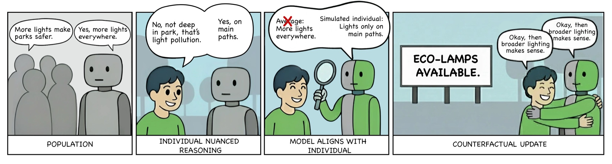

# HugAgent: A Human Simulation Benchmark for Individual-Level Reasoning

**EMNLP 2026, main conference (oral)** · [Paper](https://arxiv.org/abs/2510.15144) · [Project page](https://jajamoa.github.io/HugAgent/) · [Data on Hugging Face](https://huggingface.co/datasets/social-atoms/hugagent) · [Interview chatbot](https://github.com/jajamoa/trace-your-thinking) · [BibTeX](#citation)

Chance Jiajie Li\*, Zhenze Mo\*, Yuhan Tang\*, Ao Qu, Jiayi Wu, Kaiya Ivy Zhao, Yulu Gan, Jie Fan, Jiangbo Yu, Hang Jiang, Paul Pu Liang, Jinhua Zhao, Luis Alberto Alonso Pastor, Kent Larson  
MIT Media Lab, MIT EECS, MIT IDSS, MIT CEE, MIT DUSP, Northeastern University, Brown University, McGill University · \*equal contribution



> Can AI reason like you, or only answer like you?

HugAgent (Human-Grounded Agent Benchmark) evaluates whether a language model can simulate how a specific person reasons and updates their beliefs, given only that person's own words. It scales the think-aloud method with an LLM-driven interview chatbot. Ground truth comes from the participants themselves, reported in structured questionnaires the models never see.

**Two tasks.** *Belief state inference*: from an interview excerpt, infer a belief the person holds but never stated. *Belief dynamics update*: given a new scenario, predict how this person's stance moves, on their own scale.

**Data.** 54 participants (quality-filtered from 120), 3 contested domains (healthcare, surveillance, zoning), 1,742 items, ~85% human test-retest ceiling. The benchmark items are open; the raw interviews stay private (see `DATA_RELEASE.md`). A synthetic track (`Benchmark/synth_500.zip`) is included for controlled stress testing and is not used in the paper.

**Finding.** Models recover what a person believes: the best trail the human ceiling by 7 to 9 points. They struggle to predict how a person changes their mind: best model 68.6% vs. 85.7% for humans, and the gap holds across every model family tested.

## News

- **2026-10** Full benchmark (1,742 items) released on the Hugging Face Hub as [social-atoms/hugagent](https://huggingface.co/datasets/social-atoms/hugagent), gated, CC BY-NC 4.0.
- **2026-09** Selected for an oral presentation at EMNLP 2026 (Budapest, October 24 to 29).
- **2026-08** Accepted to EMNLP 2026, main conference.
- **2025-12** Earlier versions presented at NeurIPS 2025 workshops: PersonaLLM (oral) and LAW (spotlight).
- A scaled-up v2, with more participants and more topics, is in preparation.

## Leaderboard

ATI is the paper's unified score: 0 is random guessing, 100 is the human test-retest ceiling. Rows marked `paper` are copied from Table 2; rows marked `released data` were produced by `Benchmark/hugagent_eval.py` on the files in `Benchmark/data/`. To add a model, run the scorer on the full set and open a pull request with the JSON under `results/` (see `results/README.md`). The test set is public with gold answers, so all scores are self-reported; we re-score the submitted raw responses, nothing more. A held-out split scored by us is planned for v2.

<!-- leaderboard:start -->
| Model | BSI acc | BDU acc | BDU MAE | BDU dir. acc | ATI | Data | Source |
|---|---|---|---|---|---|---|---|
| Human (test-retest) | 84.84 | 85.66 | 0.68 | 88.92 | 100.00 | paper | paper |
| gpt-4o | 78.78 | 62.23 | 1.24 | 77.45 | 70.07 | data-v1.0 | released data |
| LLaMA 3.3 70B | 76.39 | 67.57 | 1.24 | 79.56 | 69.84 | paper | paper |
| Claude Sonnet 4.5 | 76.04 | 68.61 | 1.18 | 78.73 | 67.39 | paper | paper |
| GPT-4o | 74.66 | 63.11 | 1.29 | 82.27 | 67.29 | paper | paper |
| DeepSeek-R1 | 75.43 | 64.88 | 1.29 | 79.69 | 67.20 | paper | paper |
| RAG-FC (Qwen-max) | 77.56 | 59.97 | 1.39 | 76.80 | 65.65 | paper | paper |
| Qwen-max | 77.40 | 58.86 | 1.40 | 77.17 | 65.21 | paper | paper |
| Qwen2.5-7B-instr. | 77.18 | 58.82 | 1.40 | 77.12 | 64.83 | paper | paper |
| Qwen2.5-32B-instr. | 77.17 | 58.96 | 1.40 | 76.88 | 64.71 | paper | paper |
| GPT-5.1 (reasoning high) | 73.36 | 67.13 | 1.17 | 80.94 | 64.66 | paper | paper |
| Gemini 2.5 Pro | 75.45 | 64.87 | 1.27 | 78.65 | 64.29 | paper | paper |
| Generative Agents (Qwen-max) | 76.19 | 58.22 | 1.40 | 76.13 | 62.43 | paper | paper |
| GPT-5-mini | 75.30 | 58.21 | 1.43 | 77.02 | 61.53 | paper | paper |
| o3-mini | 75.12 | 64.54 | 1.22 | 71.29 | 60.92 | paper | paper |
| Gemini 2.0 Flash | 69.95 | 60.55 | 1.35 | 83.31 | 59.76 | paper | paper |
| RAG (Qwen-max) | 75.46 | 51.90 | 1.57 | 72.25 | 54.96 | paper | paper |
| Global majority (A, 1) | 63.64 | 58.32 | 1.68 | 15.34 | 2.02 | data-v1.0 | baseline |
| Random guess (mean of 5 seeds) | 50.51 | 43.50 | 1.86 | 47.93 | -0.68 | data-v1.0 | baseline |
<!-- leaderboard:end -->

## Usage

### Load from the Hugging Face Hub

The benchmark is a gated dataset: accept the terms once on the dataset page, then `hf auth login`.

```python
from datasets import load_dataset
bsi = load_dataset("social-atoms/hugagent", "belief_state_inference", split="test")
bdu = load_dataset("social-atoms/hugagent", "belief_dynamics_update", split="test")
```

The same items are in `Benchmark/data/` as jsonl for use with the scripts below.

### Core Scripts

#### Data Processing
```bash
cd Benchmark/
python process_data.py
# Needs the private raw interview folders (not in this repository); regenerates the item files

# With options (space-separated context lengths)
python process_data.py --context-lengths short medium --max-workers 5 --max-users 20

# Single context length
python process_data.py --context-lengths long --task-type belief_attribution --topic zoning

# All context lengths (default)
python process_data.py --task-type belief_update --topic healthcare
```

#### Model Evaluation

`Benchmark/hugagent_eval.py` runs the paper's prompts against any OpenAI-compatible chat endpoint and writes one results JSON.

```bash
cd Benchmark
# Smoke test: 20 items per file
python hugagent_eval.py --model gpt-4o --base-url https://api.openai.com/v1 --api-key-env OPENAI_API_KEY --limit 20
# Full run (1,742 items), results file ready to submit
python hugagent_eval.py --model gpt-4o --api-key-env OPENAI_API_KEY --out ../results/gpt-4o/data-v1.0.json --save-responses ../runs/gpt-4o.jsonl
# Non-learning baselines, no API calls
python hugagent_eval.py --baseline majority
```

Flags: `--workers`, `--temperature` (default 0.1), `--no-demographics`, `--no-context`. Metrics follow Appendix R.1 of the paper. Directional accuracy pairs each scenario stance item with the same participant's baseline stance item (1.1, 2.1, 3.1), so it covers the participants who have both; the JSON reports the pair count.

`evaluate_qwen.py` is the original per-file script used for the paper (DashScope, Gemini and Novita clients in `llm_utils.py`); it is kept for reference.

### Human Annotation Tool

Launch interactive annotation interface:
```bash
# Open in browser
open human_annotation_tool.html

# Or serve locally
python -m http.server 8000
```

**Usage:**
1. Drag JSONL data files (belief attribution or belief update)
2. Select context length and start annotation
3. Export your annotations as JSON for analysis

## Benchmark Tasks

**Belief-State Inference (BSI)**: Recover a participant’s latent belief state and factor polarity from prior conversational responses.
Models predict whether one factor is believed to have a positive, negative, or neutral effect on another.

**Belief-Dynamics Update (BDU)**: Predict how belief states and reasoning weights change when participants encounter new evidence or counterfactual interventions, given their prior beliefs and contextual cues.

## Files

```
├── Benchmark/
│   ├── data/                    # The 1,742 benchmark items (CC BY-NC 4.0), one file per task x domain
│   │   ├── belief_state_inference_{healthcare,surveillance,zoning}.jsonl
│   │   ├── belief_dynamics_update_{healthcare,surveillance,zoning}.jsonl
│   │   └── LICENSE
│   ├── survey_content/          # Survey questions and reason-code mappings
│   ├── hugagent_eval.py         # Scorer for any OpenAI-compatible endpoint, writes results JSON
│   ├── evaluate_qwen.py         # Original per-file evaluation script used for the paper
│   ├── run_all_evaluations.sh   # Batch evaluation script (parallel)
│   ├── llm_utils.py             # API wrappers (DashScope, Gemini, OpenRouter)
│   ├── process_data.py          # Builds items from the private raw interviews (not runnable without them)
│   └── synth_500.zip            # Synthetic stress-test track, not used in the paper
├── hf/                          # Hugging Face dataset card and parquet build
├── results/                     # Leaderboard rows, one JSON per model (submit by PR)
├── scripts/build_release.py     # Internal jsonl -> public jsonl + parquet, with a privacy lint
├── DATA_RELEASE.md              # What is public, what is private, and how releases are made
└── human_annotation_tool.html   # Interactive annotation interface
```

Each item carries `item_id` (stable across releases), `participant_id` (`P01` to `P54`, no link to recruitment platform ids), `demographics` (no location field), `context_qas` (the participant's own interview answers used as context), and the task fields. See `hf/README.md` for the column table.

## Output Format

Evaluation generates `evaluation_results_{model}_by_difficulty.json`:
```json
{
  "simple": {"total": 50, "correct": 39, "accuracy": 0.78, "answers": [...]},
  "medium": {"total": 50, "correct": 40, "accuracy": 0.80, "answers": [...]},
  "hard":   {"total": 50, "correct": 34, "accuracy": 0.68, "answers": [...]}
}
```

## Licensing

The code in this repository is released under the [MIT License](LICENSE).

The benchmark items under `Benchmark/data/` are released under
[CC BY-NC 4.0](Benchmark/data/LICENSE). They were collected from consenting participants
under an approved IRB protocol and are released in de-identified form only. The raw
interview recordings, transcripts and survey exports are not public. The data is
intended for research on evaluating individualized reasoning, and must not be
used to build systems that persuade, profile, or target individuals.

## Citation

If you use HugAgent, please cite the paper:

```bibtex
@inproceedings{li2026hugagent,
  title     = {HugAgent: A Human Simulation Benchmark for Individual-Level Reasoning},
  author    = {Li, Chance Jiajie and Mo, Zhenze and Tang, Yuhan and Qu, Ao and
               Wu, Jiayi and Zhao, Kaiya Ivy and Gan, Yulu and Fan, Jie and
               Yu, Jiangbo and Jiang, Hang and Liang, Paul Pu and Zhao, Jinhua and
               Alonso Pastor, Luis Alberto and Larson, Kent},
  booktitle = {Proceedings of the 2026 Conference on Empirical Methods in
               Natural Language Processing (EMNLP)},
  year      = {2026},
  note      = {Oral}
}
```
